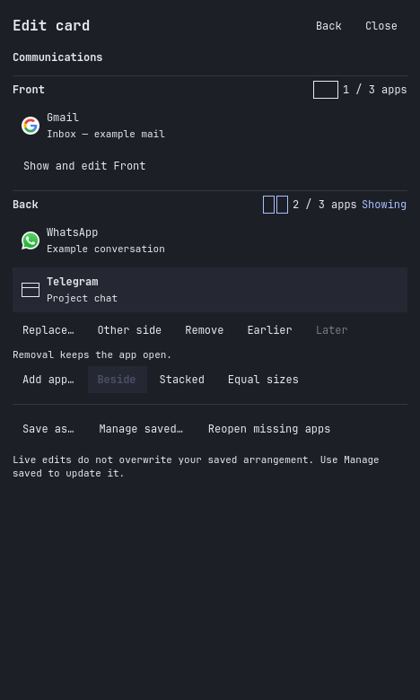

# OmaCards

A compact Omarchy bar panel for [Hyprflip](https://github.com/nocstah/hyprflip).
Open a saved card, see its two sides, edit any app, and tune the turn.



The screenshot uses synthetic example content. OmaCards follows your current
Omarchy theme and font.

## What it does

- **Cards:** flip, unfold/fold, save, or create an arrangement. Search your saved
  cards and select one to open it here or go to its existing workspace.
- **Edit:** see Front and Back, add apps from this or another workspace, replace
  or remove any pane, move it across sides, reorder panes, and switch between
  beside/stacked layouts. Removed apps remain open.
- **Saved arrangements:** rename, duplicate, delete, deliberately update the
  saved layout, or reopen missing apps through the same Hyprflip workflows.
- **Motion:** seven transitions, individual previews, speed presets and exact
  duration. Dissolve and Portal are experimental. Settings apply to all cards.
- **Keyboard:** search with arrows and Enter, Tab through controls, Escape to
  go back or cancel. Existing F/O/Space shortcuts continue working.

OmaCards runs in Omarchy's shell. It does not replace the compositor plugin,
maintain a second card database, or start a background Python daemon.

## Requirements

- Omarchy 4's stock Quickshell bar; tested with 4.0.4.
- Current Hyprflip plus its JSON helper (protocol 1), Python 3 and GLib.
- For multi-app and saved cards: the matching Hyprflip hy3 provider, up to three
  apps per face. A basic native pair still supports Flip and Motion.

Follow [Hyprflip installation](https://github.com/nocstah/hyprflip/blob/main/docs/INSTALL.md)
for the compositor components. Installing OmaCards never builds, replaces or
unloads them.

From your current Hyprflip checkout, install the shared helper:

```sh
python3 scripts/install-setup.py --dry-run
python3 scripts/install-setup.py
```

For native pairs without containers, use `--backend-only` on both commands.
This installs the helper and persistent motion preferences without rebinding
container shortcuts. The installer backs up replaced files and checks that
existing cards survive the configuration reload.

## Install this checkout

Until the companion repository is published, install your local checkout:

```sh
omarchy plugin add /absolute/path/to/omacards --enable --yes
```

The directory must be a Git checkout with `manifest.json` at its root. The
Omarchy installer clones it to
`~/.config/omarchy/plugins/io.github.nocstah.omacards/` and adds the bar icon.
Click the cards icon to open the panel.

With the updated helper, **Super+Ctrl+Alt+C** opens Edit and
**Super+Ctrl+Alt+L** opens the library. If OmaCards is disabled or unavailable,
those shortcuts use the original native menus. **O** keeps guided creation and
fold/unfold, **F** keeps flip, and **Space** keeps hold-to-peek. Super+J is unchanged.

You can also open it from a terminal:

```sh
omarchy-shell omacards open cards
omarchy-shell omacards open edit
omarchy-shell omacards open library
omarchy-shell omacards open motion
```

## Use and recovery

Focus an app before opening the panel to select its card. If it is ungrouped,
**Create a new card** names that app as the front. Choose **Choose app for back…**
and select another open app. Saved cards appear separately above creation;
you can open them without creating anything. If several cards share a workspace,
choose one from the list. Hidden faces offer **Show and edit Front/Back**;
that action turns the card before offering edits.

In Edit, select a visible app to reveal its pane actions. **Manage saved** offers
Update when the running card can be saved. Ordinary live edits leave the saved
definition unchanged. Opening an already open card goes to it; it does not
launch a duplicate. Cancellation leaves launched apps open and uses Hyprflip's
existing partial-operation recovery.

If a window closes or moves while choosing, the operation stops with a refresh
message. Keep the original native menu available explicitly:

```sh
python3 ~/.local/lib/hyprflip/setup.py --legacy --cards
omarchy-shell omacards status
```

Motion settings are stored with Hyprflip, in `$XDG_STATE_HOME/hyprflip` (normally
`~/.local/state/hyprflip`), alongside the existing saved-card library. Disabling
OmaCards leaves them, your apps, cards and compositor plugins intact:

```sh
omarchy plugin disable io.github.nocstah.omacards
omarchy plugin enable io.github.nocstah.omacards
```

Replacement bars and older Omarchy shell APIs have not been validated. No
compositor restart is needed for this QML interface.

## Development and checks

See [the protocol](https://github.com/nocstah/hyprflip/blob/main/docs/PANEL_API.md).
The workflow backend belongs to Hyprflip; do not copy it into this project.

```sh
omarchy plugin validate .
python3 tests/render.py
python3 tests/run-native.py /tmp/oc-demo/session.json \
  --backend /path/to/hyprflip/scripts/control.py
```

The last check requires Hyprflip's disposable three-window session:
`python3 tests/nested_session.py --directory /tmp/oc-demo --containers` from its
checkout. The runner rejects a live desktop connection, creates a headless
test output, and tests popup focus, flip/unfold, structured save/edit, motion
and direct saved-card activation. Rendering uses synthetic fixture data.

MIT licensed. Built on Hyprflip and Omarchy's native shell components.
